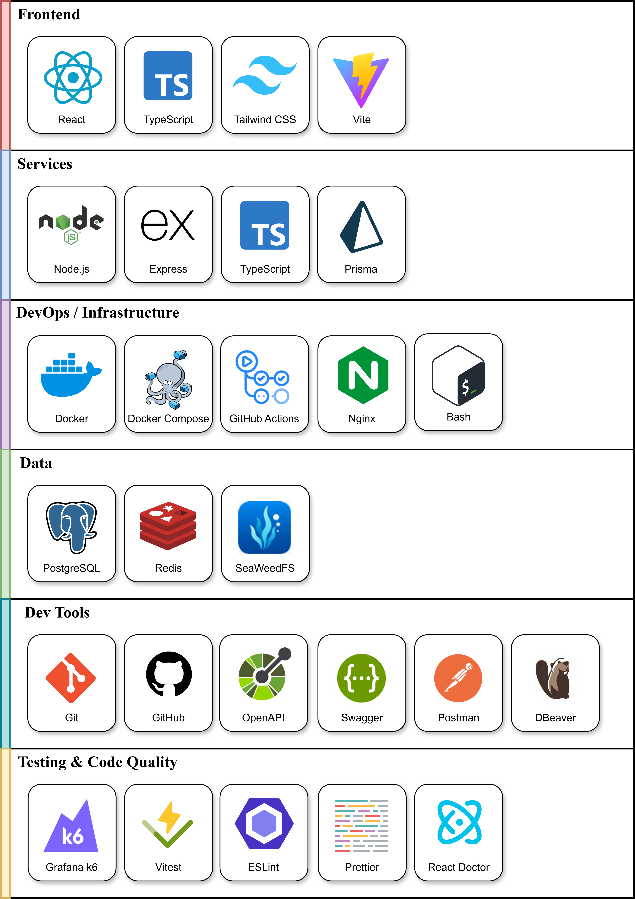
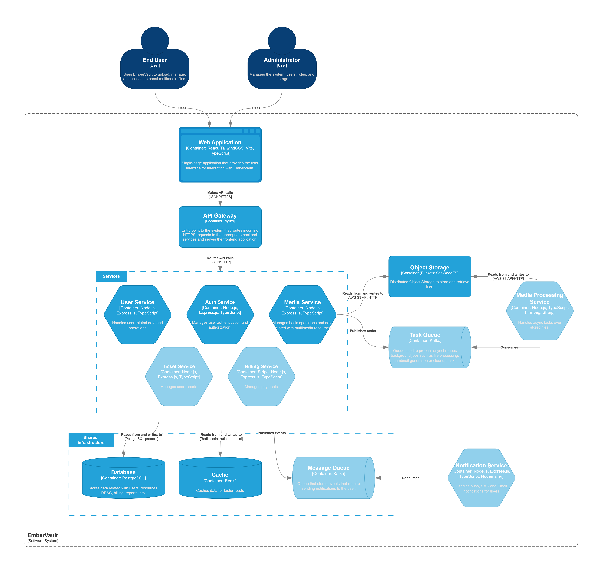

# EmberVault


EmberVault is a full-stack scalable multimedia file management platform designed with a microservices architecture. It provides file storage, user management and media handling and sharing, similar in spirit to platforms like Google Drive, Dropbox, MEGA or Proton Drive.

This project was developed as a **final-year Computer Science thesis**, with a focus on scalable system design, distributed services and DevOps practices.

---

## Goals

The main objectives behind EmberVault were:

- Design and implement a **microservices-based architecture**
- Explore **scalable backend patterns**
- Handle **large file uploads and object storage**
- Apply **containerization and orchestration**
- Build a complete **production-like full-stack system**

---

## Tech Stack

### Development Tools
- **GitHub Projects** - project management and planning  
- **Postman** - API testing and debugging  
- **DBeaver** - database management
- **redis-commander** - redis management and monitoring

### Core Stack
- **Version Control:** Git + GitHub  
- **Backend:** Node.js, Express, TypeScript
- **Database:** PostgreSQL  
- **ORM:** Prisma
- **Cache:** Redis
- **Frontend:** React, TypeScript, TailwindCSS  
- **File Storage:** SeaweedFS (S3 compatible Object Storage)

### Infrastructure & DevOps
- **Containerization:** Docker  
- **Orchestration:** Docker Compose  
- **Reverse Proxy / API Gateway:** Nginx  
- **Authentication:** JWT + bcrypt  
- **CI/CD:** GitHub Actions  
- **Automation:** Bash, PowerShell  
- **API Documentation:** OpenAPI / Swagger  
- **Local HTTPS certificates:** mkcert  

### Design & Architecture
- **Figma** - UI/UX design and prototyping  
- **draw.io** - system architecture diagrams  
- **Inkscape** - vector graphics and logo design  

### Testing & Code Quality
- **Grafana k6** - Load testing
- **Vitest** - unit testing framework  
- **ESLint** - linting and code consistency  
- **Prettier** - code formatting

### Tech Stack Summary



---

## Architecture Overview

EmberVault follows a **microservices architecture**, where each domain is isolated into independent services:

- **Auth Service** → Authentication and authorization
- **User Service** → User data management
- **Media Service** → File handling and metadata
- **SeaweedFS** → Distributed object storage
- **PostgreSQL** → Relational data persistence
- **Nginx** → API Gateway and HTTPS reverse proxy
- **Redis** → Distributed cache

All services are orchestrated via Docker Compose and exposed under a single domain for local deployment: `https://embervault.local`

### Diagram:
> (low opacity nodes are not yet implemented)



---

## Repository Structure

```text
.
├── apps/
│   ├── web/                # React + Vite frontend
│   ├── auth-service/       # Authentication service
│   ├── user-service/       # User service
│   └── media-service/      # Media service
│
├── docs/                  # Docs, iamges and diagrams
│
├── packages/
│   └── auth-utils/         # Shared authentication library
│
├── infrastructure/
│   ├── db/                 # DB deployment
│   ├── nginx/              # Reverse proxy config
│   ├── certs/              # Local TLS certificates
│   ├── cache/              # Redis deployment and config
│   └── seaweedfs/          # Object storage setup
│
├── scripts/                # Scripts
│
├── tests/                  # Tests
│
├── compose.yaml            # Docker Compose orchestration
└── .env.example            # Environment variables template
```

## Quick Start

### 1. Clone the repository

```bash
git clone https://github.com/agm-22/EmberVault/
cd EmberVault
```

---

### 2. Configure environment variables

Copy `.env.example` → `.env` and fill required values.

Repeat for each service:

- `auth-service/.env`
- `user-service/.env`
- `media-service/.env`
- `web/.env`

---

### 3. Setup local HTTPS

```bash
# Linux / macOS
bash ./scripts/setup-dev.sh

# Windows
./scripts/setup-dev.ps1
```

---

### 4. Run the full stack

```bash
docker compose up --build
```

---

### 5. Open the application

```
https://embervault.local
```
